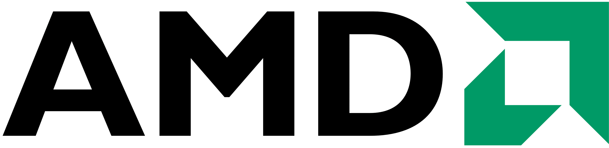
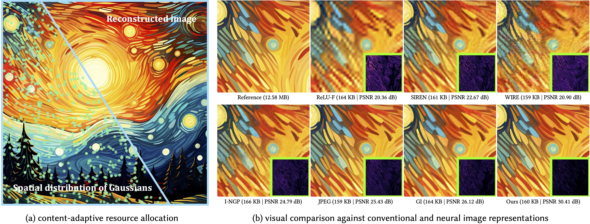

<div align="center">

<h1>Image-GS: Content-Adaptive Image Representation via 2D Gaussians</h1>

[**Yunxiang Zhang**](https://yunxiangzhang.github.io/)<sup>1\*</sup>,
[**Bingxuan Li**](https://bingxuan-li.github.io/)<sup>1\*</sup>,
[**Alexandr Kuznetsov**](https://alexku.me/)<sup>3&dagger;</sup>,
[**Akshay Jindal**](https://www.akshayjindal.com/)<sup>2</sup>,
[**Stavros Diolatzis**](https://www.sdiolatz.info/)<sup>2</sup>,
[**Kenneth Chen**](https://kenchen10.github.io/)<sup>1</sup>,
[**Anton Sochenov**](https://www.intel.com/content/www/us/en/developer/articles/community/gpu-researchers-anton-sochenov.html)<sup>2</sup>,
[**Anton Kaplanyan**](http://kaplanyan.com/)<sup>2</sup>,
[**Qi Sun**](https://qisun.me/)<sup>1</sup>

\* Equal contribution &emsp; &dagger; Work done while at Intel

<sup style="vertical-align: top;">1</sup>
<a href="https://www.immersivecomputinglab.org/research/"></a>
&emsp;
<sup style="vertical-align: top;">2</sup>
<a href="https://www.intel.com/content/www/us/en/developer/topic-technology/graphics-research/overview.html"></a>
&emsp;
<sup style="vertical-align: top;">3</sup>
<a href="https://www.amd.com/en.html"></a>

<a href="https://arxiv.org/abs/2407.01866"></a>
<a href="https://www.immersivecomputinglab.org/publication/image-gs-content-adaptive-image-representation-via-2d-gaussians/"></a>
<a href="https://github.com/NYU-ICL/image-gs"></a>

</div>

<div style="width: 90%; margin: 0 auto; text-align: left;">
  <p style="margin-top: 0.5em; font-size: 1.0em;">
  Neural image representations have emerged as a promising approach for encoding and rendering visual data. Combined with learning-based workflows, they demonstrate impressive trade-offs between visual fidelity and memory footprint. Existing methods in this domain, however, often rely on fixed data structures that suboptimally allocate memory or compute-intensive implicit models, hindering their practicality for real-time graphics applications.
  
  Inspired by recent advancements in radiance field rendering, we introduce Image-GS, a content-adaptive image representation based on 2D Gaussians. Leveraging a custom differentiable renderer, Image-GS reconstructs images by adaptively allocating and progressively optimizing a group of anisotropic, colored 2D Gaussians. It achieves a favorable balance between visual fidelity and memory efficiency across a variety of stylized images frequently seen in graphics workflows, especially for those showing non-uniformly distributed features and in low-bitrate regimes. Moreover, it supports hardware-friendly rapid random access for real-time usage, requiring only 0.3K MACs to decode a pixel. Through error-guided progressive optimization, Image-GS naturally constructs a smooth level-of-detail hierarchy. We demonstrate its versatility with several applications, including texture compression, semantics-aware compression, and joint image compression and restoration.
  </p>
  
  <p style="margin-top: 0.5em; font-size: 0.9em; color: #888;">
  Figure 1: Image-GS reconstructs an image by adaptively allocating and progressively optimizing a set of colored 2D Gaussians. It achieves favorable rate-distortion trade-offs, hardware-friendly random access, and flexible quality control through a smooth level-of-detail stack. (a) visualizes the optimized spatial distribution of Gaussians (20% randomly sampled for clarity). (b) Image-GS’s explicit content-adaptive design effectively captures non-uniformly distributed image features and better preserves fine details under constrained memory budgets. In the inset error maps, brighter colors indicate larger errors.
  </p>
</div>

## Setup
1. Create a dedicated Python environment and install the dependencies
    ```bash
    git clone https://github.com/NYU-ICL/image-gs.git
    cd image-gs
    conda env create -f environment.yml
    conda activate image-gs
    pip install git+https://github.com/rahul-goel/fused-ssim/ --no-build-isolation
    cd gsplat
    pip install -e ".[dev]"
    cd ..
    ```
2. Download the image and texture datasets from [OneDrive](https://1drv.ms/u/c/3a8968df8a027819/EeshjZJlMtdCmvvmESiN2pABM71EDaoLYmEwuOvecg0tAA?e=GybqBv) and organize the folder structure as follows
    ```
    image-gs
    └── media
        ├── images
        └── textures
    ```
3. (Optional) To run saliency-guided Gaussian position initialization, download the pre-trained [EML-Net](https://github.com/SenJia/EML-NET-Saliency) models ([res_imagenet.pth](https://drive.google.com/open?id=1-a494canr9qWKLdm-DUDMgbGwtlAJz71), [res_places.pth](https://drive.google.com/open?id=18nRz0JSRICLqnLQtAvq01azZAsH0SEzS), [res_decoder.pth](https://drive.google.com/open?id=1vwrkz3eX-AMtXQE08oivGMwS4lKB74sH)) and place them under the `models/emlnet/` folder
    ```
    image-gs
    └── models
        └── emlnet
            ├── res_decoder.pth
            ├── res_imagenet.pth
            └── res_places.pth
    ```

## Quick Start

#### Image Compression 
- Optimize an Image-GS representation for an input image `anime-1_2k.png` using `10000` Gaussians with half-precision parameters
```bash
python main.py --input_path="images/anime-1_2k.png" --exp_name="test/anime-1_2k" --num_gaussians=10000 --quantize
```
- Render the corresponding optimized Image-GS representation at a new resolution with height `4000` (aspect ratio is maintained)
```bash
python main.py --input_path="images/anime-1_2k.png" --exp_name="test/anime-1_2k" --num_gaussians=10000 --quantize --eval --render_height=4000
```

#### Texture Stack Compression
- Optimize an Image-GS representation for an input texture stack `alarm-clock_2k` using `30000` Gaussians with half-precision parameters
```bash
python main.py --input_path="textures/alarm-clock_2k" --exp_name="test/alarm-clock_2k" --num_gaussians=30000 --quantize
```
- Render the corresponding optimized Image-GS representation at a new resolution with height `3000` (aspect ratio is maintained)
```bash
python main.py --input_path="textures/alarm-clock_2k" --exp_name="test/alarm-clock_2k" --num_gaussians=30000 --quantize  --eval --render_height=3000
```

#### Control bit precision of Gaussian parameters
- Optimize an Image-GS representation for an input image `anime-1_2k.png` using `10000` Gaussians with 12-bit-precision parameters
```bash
python main.py --input_path="images/anime-1_2k.png" --exp_name="test/anime-1_2k" --num_gaussians=10000 --quantize --pos_bits=12 --scale_bits 12 --rot_bits 12 --feat_bits 12
```

#### Switch to saliency-guided Gaussian position initialization 
- Optimize an Image-GS representation for an input image `anime-1_2k.png` using `10000` Gaussians with half-precision parameters and saliency-guided initialization
```bash
python main.py --input_path="images/anime-1_2k.png" --exp_name="test/anime-1_2k" --num_gaussians=10000 --quantize --init_mode="saliency"
```

#### Command Line Arguments
Please refer to `cfgs/default.yaml` for the full list of arguments and their default values.

**Post-optimization rendering**
- `--eval` render the optimized Image-GS representation.
- `--render_height` image height for rendering (aspect ratio is maintained).

**Bit precision control**: 32 bits (float32) per dimension by default 
- `--quantize` enable bit precision control of Gaussian parameters.
- `--pos_bits` bit precision of individual coordinate dimension.
- `--scale_bits` bit precision of individual scale dimension.
- `--rot_bits` bit precision of Gaussian orientation angle.
- `--feat_bits` bit precision of individual feature dimension.

**Logging**
- `--exp_name` path to the logging directory.
- `--vis_gaussians`: visualize Gaussians during optimization.
- `--save_image_steps` frequency of rendering intermediate results during optimization.
- `--save_ckpt_steps` frequency of checkpointing during optimization.

**Input image**
- `--input_path` path to an image file or a directory containing a texture stack.
- `--downsample` load a downsampled version of the input image or texture stack as the optimization target to evaluate image upsampling performance.
- `--downsample_ratio` downsampling ratio.
- `--gamma` optimize in a gamma-corrected space, modify with caution.

**Gaussian**
- `--num_gaussians` number of Gaussians (for compression rate control).
- `--init_scale` initial Gaussian scale in number of pixels.
- `--disable_topk_norm` disable top-K normalization.
- `--disable_inverse_scale` disable inverse Gaussian scale optimization.
- `--init_mode` Gaussian position initialization mode, valid values include "gradient", "saliency", and "random".
- `--init_random_ratio` ratio of Gaussians with randomly initialized position.

**Optimization**
- `--disable_tiles` disable tile-based rendering (warning: optimization and rendering without tiles will be way slower).
- `--max_steps` maximum number of optimization steps.
- `--pos_lr` Gaussian position learning rate.
- `--scale_lr` Gaussian scale learning rate.
- `--rot_lr` Gaussian orientation angle learning rate.
- `--feat_lr` Gaussian feature learning rate.
- `--disable_lr_schedule` disable learning rate decay and early stopping schedule.
- `--disable_prog_optim` disable error-guided progressive optimization.

## Acknowledgements
We would like to thank the [gsplat](https://github.com/nerfstudio-project/gsplat) team, and the authors of [3DGS](https://github.com/graphdeco-inria/gaussian-splatting), [fused-ssim](https://github.com/rahul-goel/fused-ssim), and [EML-Net](https://github.com/SenJia/EML-NET-Saliency) for their great work, based on which Image-GS was developed.

## License
This project is licensed under the terms of the MIT license.

## Citation
If you find this project helpful to your research, please consider citing [BibTeX](assets/docs/image-gs.bib):
```bibtex
@inproceedings{zhang2025image,
  title={Image-gs: Content-adaptive image representation via 2d gaussians},
  author={Zhang, Yunxiang and Li, Bingxuan and Kuznetsov, Alexandr and Jindal, Akshay and Diolatzis, Stavros and Chen, Kenneth and Sochenov, Anton and Kaplanyan, Anton and Sun, Qi},
  booktitle={Proceedings of the Special Interest Group on Computer Graphics and Interactive Techniques Conference Conference Papers},
  pages={1--11},
  year={2025}
}
```